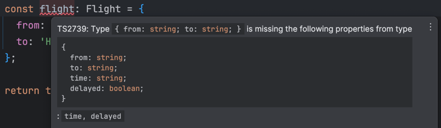
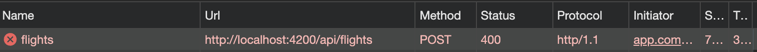
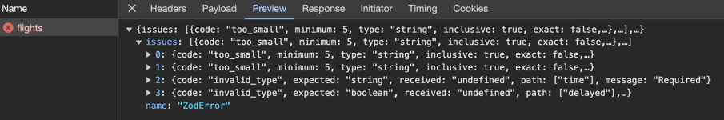

# Validierte und typensichere REST-Schnittstellen mit Nest.js und zod

Ein großer Vorteil von TypeScript im Backend, ist die Möglichkeit Typen und Interfaces zwischen Frontend und Server zu teilen. Dies wird in einem Nx Workspace besonders einfach, in diesem lassen sich mittels Models zwischen Frontend und Server teilen. Somit kann sichergestellt werden, dass auf der Typen-Ebene bereits nicht viel schiefgehen kann. Da TypeScript aber zur Laufzeit nicht mehr existiert und Daten bei REST in der Regel mittels untypisiertem JSON übertragen werden, sollte zusätzlich eine Validierung der Daten am Backend stattfinden. Validierung am Backend ist wichtig für die Sicherheit der Schnittstelle und damit der gesamten Anwendung. Zusätzlich können über die Validierung bereits fachlich ungültige Daten ausgefiltert oder abgelehnt werden.

In diesem Artikel wird gezeigt, wie mit der Library `zod` ein alternativer Ansatz zur Built-In `ValidationPipe` von Nest.js zur Validierung von Daten implementiert werden kann.

📂 [Source Code](https://github.com/NemoContra/angular-nestjs-zod)

## Die Nest.js ValidationPipe

Nest.js bietet bereits die Built-In `ValidationPipe` an. Diese setzt auf die npm-Libraries `class-validator` und `class-transformer` und fährt damit einen objektorientierten und deklarativen Ansatz. Die Validierung wird definiert, indem zuerst die Datenstruktur modelliert wird. Die Validierungsinformationen können dann mittels Decorators als Metadaten bereitgestellt werden.

Beispiel:

```typescript
import { IsBoolean, IsDateString, IsOptional, IsString, MaxLength, MinLength } from 'class-validator';

export class Flight {
  @IsString()
  @MinLength(5)
  @MaxLength(100)
  from: string;

  @IsString()
  @MinLength(5)
  @MaxLength(100)
  to: string;

  @IsDateString()
  time: string;

  @IsOptional()
  @IsBoolean()
  delayed: boolean;
}
```

In einem Nest.js-Controller findet dann die Validierung wie folgt statt:

```typescript
import { Body, Controller, Get, Post, UsePipes, ValidationPipe } from '@nestjs/common';
import { FlightService } from './flight.service';
import { FlightDto } from '../models/flight';

@Controller('flights')
export class FlightController {
  constructor(private readonly flightService: FlightService) {}

  @Get()
  getFlights(): FlightDto[] {
    return this.flightService.getAllFlights();
  }

  @Post()
  @UsePipes(new ValidationPipe({ transform: true }))
  createFlight(@Body() flight: FlightDto): void {
    this.flightService.createFlight(flight);
  }
}
```

Durch den deklarativen Ansatz ist der Code sehr gut lesbar, die eingebaute Integration in Nest.js macht die Validierung sehr leicht. Dieser Ansatz hat aber auch Nachteile. Zum Beispiel lassen sich die Libraries `class-validator` und `class-transformer` im frontend nicht ohne optimal nutzen, da einige Features der Library die Abhängigkeit `reflect-metadata` verwenden und diese eine Erhöhung der Frontend-Bundle-Size mit sich bringt. Zusätzlich wird von einem Einsatz von Klassen in vielen Frontend State Management Libraries abgeraten, um die Serialisierbarkeit der Daten sicherzustellen. Dies gilt zum Beispiel auch für die State-Management-Library ngrx in Angular.

## Nest.js-Validierung mit zod

Seit einiger Zeit hat die Validation Library `zod` in der TypeScript-Community viel Aufmerksamkeit bekommen. Sie erlaubt es, die Verantwortlichkeiten herumzudrehen und uns als Entwickler erst den Validierungs-Code schreiben zu lassen. Um die Modellierung der Typen kümmert sich die Library dann voll automatisch. Dazu nutzt sie sehr klug fortgeschrittene TypeScript-Features und erstellt die Typen automatisch aus unserem Validierungs-Code. Dies kann für unser Beispiel so aussehen:

```typescript
import { z } from 'zod';

export const flightSchema = z
  .object({
    from: z.string().min(5).max(100),
    to: z.string().min(5).max(100),
    time: z.string().datetime(),
    delayed: z.boolean(),
  })
  .required();

export type Flight = z.infer<typeof flightSchema>;
```

Wir definieren also mittels der von `zod` importieren Funktionen die gesamte Beschaffenheit unseres Objektes und reichern es im selben Schritt direkt mit Validierungsinformationen an. Den Typen kann uns `zod` am Ende mittels der Hilfsfunktion `z.infer` automatisch generieren. Der Typ `Flight` lässt sich nun über eine Nx lib teilen und somit im Frontend und Backend verwenden. So können wir zum Beispiel in einem Angular-Frontend einen neuen Flug wie folgt anlegen:

```typescript
import { inject, Injectable } from '@angular/core';
import { HttpClient } from '@angular/common/http';
import { Flight } from '@az-testing-workshop/shared/util/api-models';
import { Observable } from 'rxjs';

@Injectable({
  providedIn: 'root',
})
export class FlightService {
  private readonly httpClient = inject(HttpClient);

  createFlight(newFlight: Flight): Observable<Flight> {
    return this.httpClient.post<Flight>('/api/flights', newFlight);
  }
}
```

TypeScript kann nun auf der Typen-Ebene sicherstellen, dass nur ein korrekter Flug übergeben werden kann:



Ein entscheidender Teil fehlt nun aber noch. Damit die Validierung zur Laufzeit passieren und auch Regeln wie minLength und maxLength greifen können, muss eine eigene ValidationPipe implementiert und registriert werden. Dies ist mit wenigen Zeilen Code erledigt:

```typescript
import { BadRequestException, Injectable, PipeTransform } from '@nestjs/common';
import { ZodSchema } from 'zod';

@Injectable()
export class ZodValidationPipe implements PipeTransform {
  constructor(private readonly schema: ZodSchema) {}
  transform(value: unknown): boolean {
    try {
      return this.schema.parse(value);
    } catch (error) {
      throw new BadRequestException(error);
    }
  }
}
```

Im Controller wird die Pipe nun wie folgt eingebunden, um die Validierung für einen bestimmten Request zu aktivieren:

```typescript
import { Body, Controller, Post, UsePipes } from '@nestjs/common';
import { Flight, flightSchema } from '@az-testing-workshop/shared/util/api-models';
import { FlightService } from './flight.service';
import { ZodValidationPipe } from '../common/zod-validation-pipe.service';

@Controller('flights')
export class FlightController {
  constructor(private readonly flightService: FlightService) {}

  @Post()
  @UsePipes(new ZodValidationPipe(flightSchema))
  createFlight(@Body() flight: Flight): void {
    this.flightService.createFlight(flight);
  }
}
```

Wenn wir nun ein invalides Objekt an unsere API senden können wir folgenden Fehler sehen:





Dies beweist, dass die Validierung sowohl auf der Typenebene als auch zur Laufzeit funktioniert.

## Fazit

Die Library `zod` ermöglicht es Typen und Validierungsregeln in einem Schritt auf eine schlanke, einfache und gut lesbare Art und Weise zu erstellen. Mit wenigen Zeilen Code kann `zod` auch mit Nest.js benutzt werden. Dies kann die Sicherheit und Stabilität von Anwendungen deutlich erhöhen. Besonders Anwendungen mit aufwändiger fachlicher Logik, die viel Validierung verlangt können davon besonders profitieren.

## Quellen:

- [Nest.js Dokumentation - ValidationPipe](https://docs.nestjs.com/techniques/validation)
- [Nest.js Dokumentation - Custom Validation with zod](https://docs.nestjs.com/pipes#binding-validation-pipes)
- [zod Dokumentation](https://zod.dev/)
